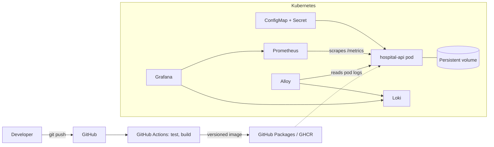

# Hospital Management System – DevOps Pipeline

A small Hospital Management System (patients, doctors, appointments) used to demonstrate a complete DevOps pipeline: automated testing, CI/CD, versioned Docker images, Kubernetes deployment, monitoring and centralized logging.

## Architecture



## Tech stack

| Area | Tool |
|---|---|
| Application | Python, FastAPI, SQLAlchemy, SQLite |
| Testing | pytest |
| CI/CD | GitHub Actions |
| Containers | Docker |
| Image registry | GitHub Container Registry (GHCR) |
| Orchestration | Kubernetes (Docker Desktop) |
| Monitoring | Prometheus and Grafana |
| Centralized logging | Loki and Grafana Alloy |

## Project structure

```
app/            FastAPI application (patients, doctors, appointments, web UI)
tests/          Automated tests
k8s/            Kubernetes manifests (Deployment, Service, ConfigMap, Secret, PVC)
monitoring/     Prometheus, Grafana, Loki and Alloy manifests
.github/        CI/CD pipeline
Dockerfile      Container image definition
VERSION         Current release version
```

## Modules and API

| Module | Endpoints |
|---|---|
| Patients | `POST/GET /patients`, `GET/DELETE /patients/{id}` |
| Doctors | `POST/GET /doctors`, `GET /doctors/{id}` |
| Appointments | `POST/GET /appointments`, `DELETE /appointments/{id}` |
| Operations | `GET /health`, `GET /metrics` |

Business rules: a patient and doctor must exist to book an appointment, and a doctor cannot be double-booked at the same time.

## Run locally

```
pip install -r requirements.txt
python -m pytest -v
python -m uvicorn app.main:app --reload
```
Open http://localhost:8000

## Run with Docker

```
docker build -t hospital-api:1.0.0 --build-arg APP_VERSION=1.0.0 .
docker run -p 8000:8000 hospital-api:1.0.0
```

## CI/CD pipeline

Defined in `.github/workflows/ci.yml`:

1. **test**: on every push and pull request, install dependencies and run pytest.
2. **build-and-push**: runs only on `main` and only if tests pass. Builds the Docker image and pushes it to GHCR with two tags: the version from the `VERSION` file (for example `1.0.0`) and the Git commit SHA.

**Releasing a new version:** edit `VERSION`, commit, push.

## Deploy to Kubernetes

```
kubectl apply -f k8s/
```
App: http://localhost:30080

- **ConfigMap** holds non-sensitive settings (log level, version).
- **Secret** holds the database connection string.
- **PersistentVolumeClaim** keeps data when the pod restarts.
- **Probes** (`/health`) let Kubernetes detect and restart an unhealthy app.

## Monitoring and logging

```
kubectl apply -f monitoring/
```

| Service | URL |
|---|---|
| Grafana (admin / hospital123) | http://localhost:30030 |
| Prometheus | http://localhost:30090 |

- **Prometheus** scrapes `/metrics` every 10 seconds.
- **Grafana** dashboard "Hospital API" shows app status, request counts, errors, requests per second, p95 latency and live logs.
- **Logging:** the app writes JSON logs to stdout, **Alloy** collects them from the pods, **Loki** stores them, and Grafana displays them.

## Known limitations and future improvements

- SQLite with one replica. Use PostgreSQL to run several replicas.
- Secrets are stored in plain YAML for this demo. Use sealed secrets or an external secrets manager in production.
- Deployments are manual (`kubectl apply`). Add automatic deployment (for example Argo CD) and image scanning.
- No authentication or authorization on the API.
